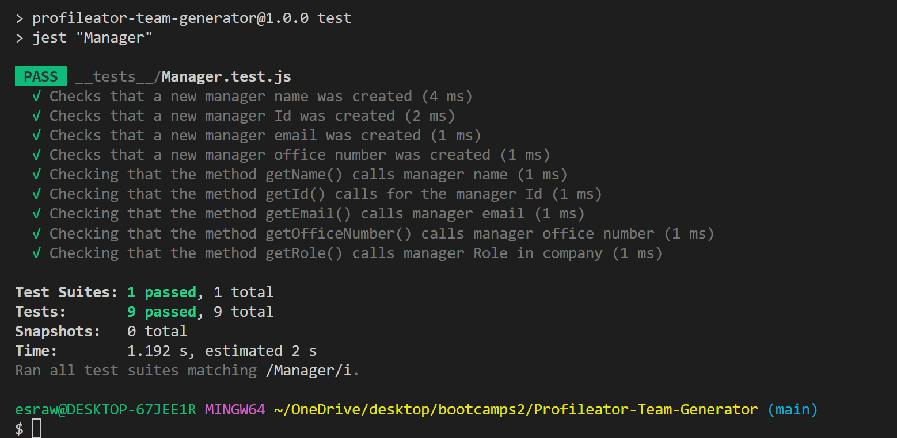

# Profileator-Team-Generator
 ## Videos and Application Image
  - You can click on either the image or this link to access the video https://www.youtube.com/watch?v=SKNfqD-BV8E&ab_channel=EsraAl-Abduljabar
 
## Description
This application was created to allow Managers of companies to efficiently create new roles/positions within their company, and add universal information about each member, such as name,id, and email. Alongside the universal information inputted for each member type, the different member types have their own customizable information inputs such as gitHub username for the Engineer, office number for the Manager, and school being attended by the intern.
## features
- Manager can add a role from a list of member options (Intern on Engineer).
- Parent classes are used to extend universal methods/properties.
- Customizable features/information in children classes (Intern, and Engineer).
- Employee information is displayed in browser.
- Unit Tests are used to ensure each method/property within a class passes the tests
## Technologies Used
- HTML: to display page and page strucute.
- CSS: to integrate styling to the application.
- javascript: to add functionality.
- jest: to perform unit testing.
- Node.js: to run javaScript in the Backend (Environment).

## Deployed Application

## Computer and Mobile View

